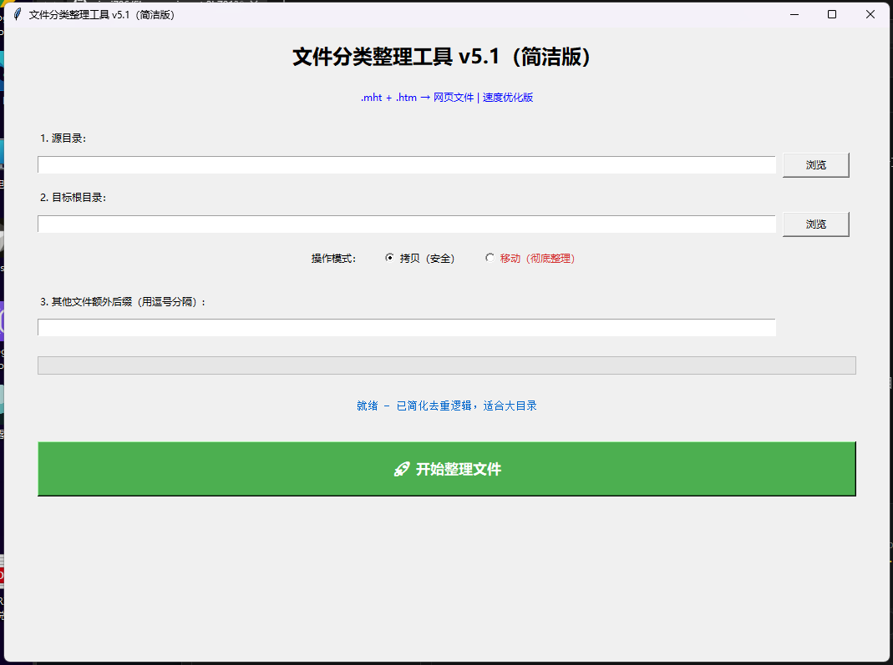

# 文件分类整理工具

一个实用、好看且高效的文件自动分类整理工具。



## 项目成果

成功整理 **31455 个文件**：
- 成功处理：**29566 个**
- 重复文件：**1888 个**

过去混乱的文件，现在都按类型 + 年份清晰归档，找文件方便多了！

## 核心功能

- 智能图片分类（Photos / Images）
- 文档细分（PDF / Word / Excel / Text）
- 自动按**年份**创建子目录（other 除外）
- 支持 **拷贝** 和 **移动** 两种模式
- 重复文件自动移动到 `Duplicates` 文件夹
- 实时进度显示 + 生成日志文件

## 使用方法

1. 选择源目录（要整理的文件夹）
2. 选择目标根目录
3. 选择操作模式（拷贝 或 移动）
4. 点击「开始整理文件」

## 技术栈

- Python 3.13
- Tkinter
- Pillow（EXIF 读取）

## 如何运行（Windows）

```powershell
venv\Scripts\activate
python file_organizer.py

## 整理完成后，目标目录结构示例：

目标目录/
├── images/
│   ├── Photos/2025/
│   ├── Photos/2024/
│   └── Images/2025/
├── documents/
│   ├── PDF/2025/
│   ├── Word/2024/
│   └── Excel/2025/
├── videos/2025/
├── audios/
├── archives/
├── other/
└── Duplicates/

## 项目文件

file_organizer.py —— 主程序
README.md —— 项目说明
venv/ —— 虚拟环境（请勿上传）
duplicates_log.txt —— 每次整理后自动生成的日志

## 后续计划

支持用户自定义分类规则
打包成单文件可执行程序（.exe / .app）
增加更多文件类型识别功能

## 学习记录

这是我学习 Python 的第一个完整项目。从最初的简单需求，到支持拷贝/移动模式、年份分类、智能去重，再到跨平台运行，每一步都让我收获满满。感谢 Grok 在整个过程中提供的耐心指导和帮助！

作者：xieyj786
创建时间：2026 年3月27日

GitHub：https://github.com/xieyj786/file_organizer


